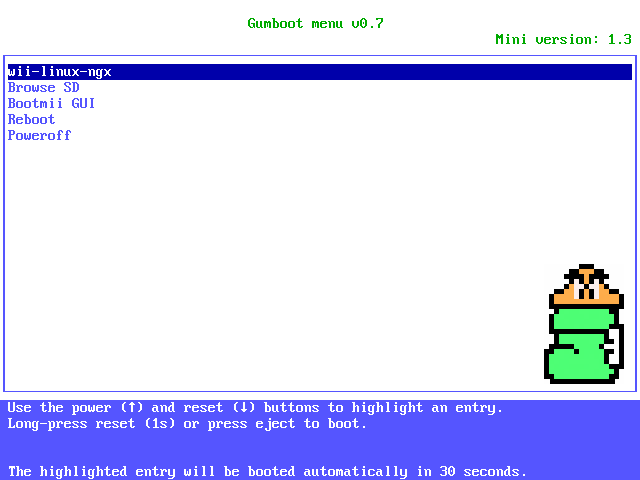

# Gumboot

Gumboot is a configurable bootloader for Wii, aimed at running Linux with customizable kernel command line without the need of recompiling for every change.

It is released in ELF format with the [wii-linux-ngx project](https://github.com/neagix/wii-linux-ngx):

* [https://github.com/neagix/wii-linux-ngx/releases](https://github.com/neagix/wii-linux-ngx/releases)

# Features

* GRUB legacy colors, CSS-style rgb() triplets colors
* navigate menu with power/reset buttons, activate with reset long press
* GameCube gamepads support
* timeout and default entry
* customizable kernel command-line arguments
* FAT16/FAT32 directory browsing and launching of ELF files
* can read from all 4 primary partitions
* reboot/poweroff
* video mode selection
* boot any ELF (including Bootmii)

# Frequently Asked Questions

<dl>
<dt>Does it support multiple partitions?</dt>
<dd>Yes, all primary partitions in FAT16 and FAT32 format are supported.</dd>
<dt>Does it support the GameCube controller?</dt>
<dd>Yes.</dd>
<dt>Does it support extended partitions?</dt>
<dd>No.</dd>
<dt>Does it support long filenames? exFAT?</dt>
<dd>No, the middleware has broken support for them. Make sure all your paths are in 8.3 format!</dd>
<dt>Does it support splash images?</dt>
<dd>No, it's a work in progress.</dd>
<dt>Does it support WiiMote?</dt>
<dd>No! It would require an USB and Bluetooth stack coded in, if you know what I am talking about.</dd>
<dt>Does it support USB storage?</dt>
<dd>No, see above.</dd>
</dl>

# Screenshot

This is a screenshot of the default [gumboot.lst](https://github.com/neagix/wii-linux-ngx/blob/master/gumboot.lst) menu:

# Thanks

Thanks to the following people:
* marcan
